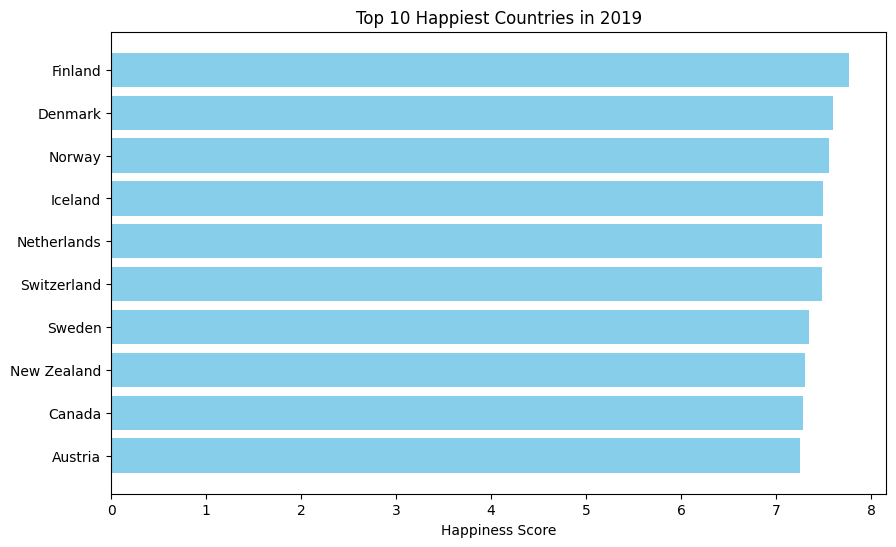

# World Happiness Analysis (2019)

This project analyzes the **World Happiness Report (2019)** and visualizes the top 10 happiest countries.

---

## Overview

- **Language:** Python  
- **Libraries:** Pandas, Matplotlib, Seaborn  
- **Environment:** Jupyter Notebook / Python scripts  

The goal is to explore happiness scores by country and provide simple visual insights.

---

## Dataset

The dataset used is from the [World Happiness Report 2019](https://worldhappiness.report/ed/2019/) and includes the following columns:

- `Overall rank`  
- `Country or region`  
- `Score`  
- `GDP per capita`  
- `Social support`  
- `Healthy life expectancy`  
- `Freedom to make life choices`  
- `Generosity`  
- `Perceptions of corruption`  

The data is stored in `data/world_happiness_2019.csv`.

---

## Example Plot

Here is a plot of the **Top 10 Happiest Countries in 2019**:



---

## Example Code

```python
import pandas as pd
import matplotlib.pyplot as plt

# Load dataset
df = pd.read_csv("data/world_happiness_2019.csv")

# Top 10 happiest countries
top10 = df.sort_values(by="Score", ascending=False).head(10)

# Plot
plt.figure(figsize=(10,6))
plt.barh(top10['Country or region'], top10['Score'], color='skyblue')
plt.xlabel("Happiness Score")
plt.title("Top 10 Happiest Countries in 2019")
plt.gca().invert_yaxis()

# Show plot
plt.show()


